# ES Config Console — User Guide

*Last updated 30 September 2026: roll back any change from the audit log, recent changes with roll back on the Data page, recreate deleted indices, optional cluster passwords, index-level access, editing documents with undo, bulk changes, node stats on the Overview, cluster settings under Administration. The same guide, kept in sync, is also a shared Claude Doc.*

The ES Config Console is the web page for reading and changing Elasticsearch configuration and documents safely: every change is previewed first, the previous state is saved before it is applied, and everything is written to an audit log.

- **Address:** <http://172.0.58.49/ui/> (the internal network only; `http://172.0.58.49/` opens it too)
- **Who it's for:** anyone who changes cluster settings, index settings, mappings, templates, ILM policies or ingest pipelines, developers who need to look at the documents in an index, and the admins who manage who may do what
- **The one rule to remember:** every change goes **Edit → Dry run → Apply**. The dry run shows exactly what would change and touches nothing. Apply saves the current config as a snapshot first, so one click rolls it back

What you can see and do depends on your access on each cluster, and sometimes on each index (see [Access levels](#access-levels)). Admins also get Cluster settings and the Clusters, Users, Allowlist and Audit log pages.

Installing the server from scratch: [FRESH_INSTALL.md](FRESH_INSTALL.md). The languages and services the project is built with: [TECH_STACK.md](TECH_STACK.md).

For scripts and automation, the same actions are available through the API; see [API_REFERENCE.md](API_REFERENCE.md) (also shared as the [ES Config API endpoint reference](https://claude.ai/code/artifact/21683e33-2775-49ce-ada3-c6a7ce220773)).

## Getting started

You sign in with your work email and the password an admin gave you; there is no self sign-up.

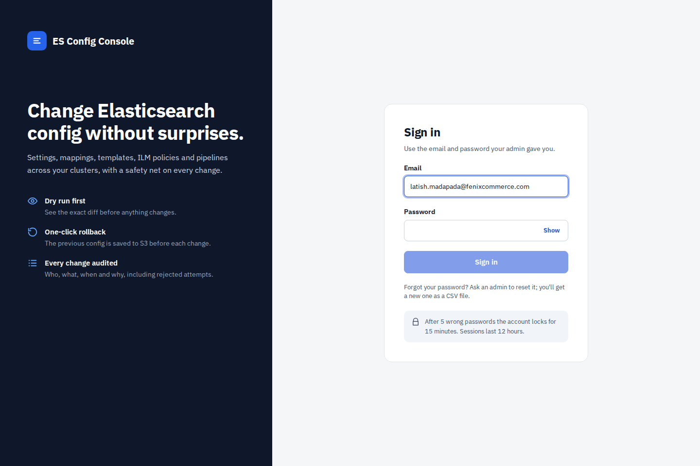

1. Open <http://172.0.58.49/ui/>.
2. Enter your email and password, then **Sign in**. Email is not case-sensitive; the password is.
3. You land on the Overview of the cluster you used last (or the first one you can access).

**Your first password** arrives from an admin as a CSV file with two columns, `username,password`. It is 16 characters and was generated for you; nobody, including the admin, can see it again.

**Change your password (optional, recommended).** Click **Change password** at the bottom of the sidebar. Enter the current password and the new one twice; the checklist turns green as each rule is met:

- at least 12 characters
- two of lowercase, uppercase and digits (or 20+ characters of anything)
- not your email address
- different from the current password

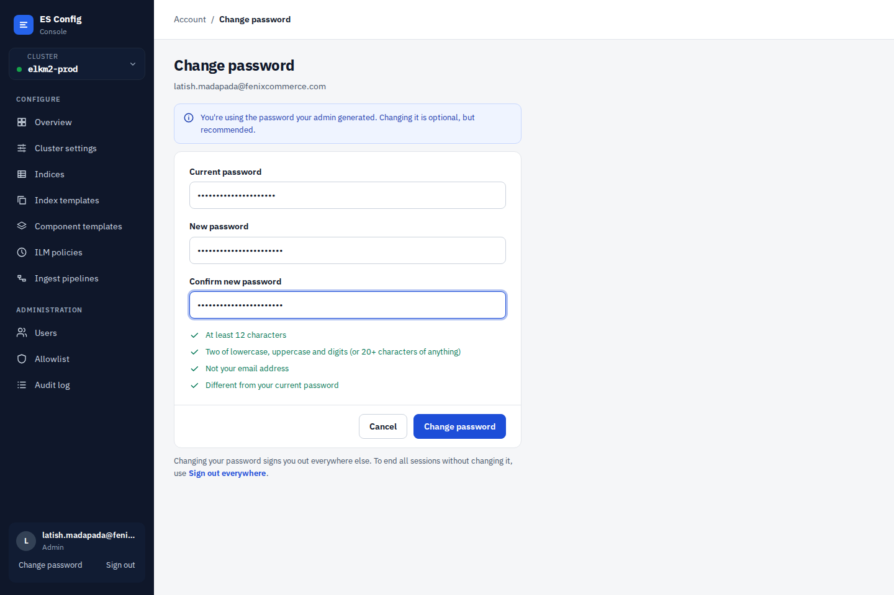

Changing your password keeps you signed in on this browser and signs you out everywhere else, including scripts that use your token.

| Situation | What happens | What to do |
| --- | --- | --- |
| Wrong password | "Wrong email or password" | Check caps lock and try again |
| 5 wrong passwords in a row | Account locked for 15 minutes | Wait, or ask an admin to reset your password (that also unlocks it) |
| Forgot your password | — | Ask an admin to reset it; you get a new CSV |
| Session expired (after 12 hours) | You are sent back to the sign-in page | Sign in again; you return to the page you were on |
| Signing out | **Sign out** at the bottom of the sidebar | Use **Sign out everywhere** on the Change password page if you think someone else has your session |

The console runs over plain HTTP on the internal network for now, so only sign in from trusted machines on that network.

## Finding your way

Everything happens on one cluster at a time: pick it in the **Cluster** box at the top of the sidebar, and every page below it shows that cluster.

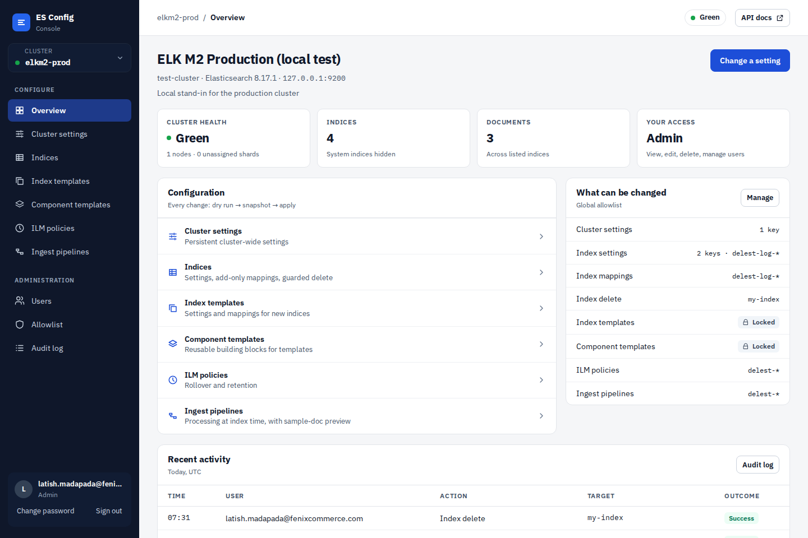

- **Sidebar, Configure:** Overview, Indices, Data, Index templates, Component templates, ILM policies, Ingest pipelines (the last four only if you have access to the whole cluster)
- **Sidebar, Administration** (admins only): Cluster settings, Clusters, Users, Allowlist, Audit log
- **Top bar:** where you are (click a part to go back) and the cluster's health (green, yellow or red), refreshed every minute
- **Overview:** health, number of indices and documents (system indices hidden), your access, the **Nodes** table, and links to each area. Admins also see what the allowlist allows on this cluster and today's activity
- **Switching clusters** keeps you on the same kind of page (for example Indices on the other cluster)

### Nodes: CPU, memory and disk

The **Nodes** card on the Overview shows every node of the cluster, refreshed every 30 seconds:

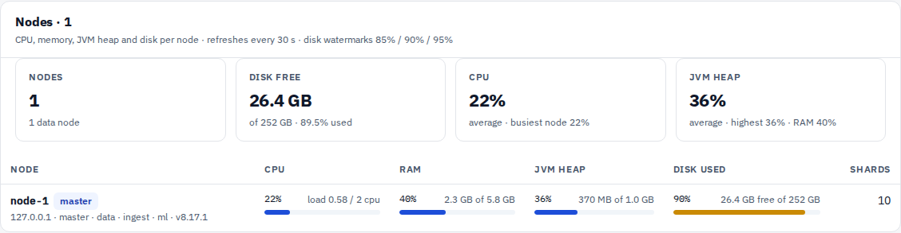

| Column | What it shows | Watch for |
| --- | --- | --- |
| Node | Name, **master** badge on the elected master, IP, roles, version | — |
| CPU | CPU use now, and the 1-minute load / number of CPUs | Staying above 75–90% |
| RAM | Memory used by the whole server | High is normal on Linux (the file cache counts as used) |
| JVM heap | Elasticsearch's own memory | Above 75% (amber) or 85% (red) for long |
| Disk used | Used %, and free space of total | The bar turns amber at the *low* watermark (85%: no new shards placed there) and red at the *high* one (90%: shards move away). At 95% indices become read-only |
| Shards | Shards on that node | Very uneven numbers between nodes |

The four boxes above the table sum it up: number of nodes, total free disk, average and busiest CPU, average and highest heap.

### Access levels

An admin sets your level per cluster. Each level includes the ones above it.

| Level | You can |
| --- | --- |
| View | Read config, health, snapshots and the deleted-index list; search, read and export documents under **Data** |
| Edit | Also dry run, apply and roll back changes; edit, add and delete single documents; bulk update documents |
| Delete | Also delete indices and bulk delete documents |
| Admin | Everything on every cluster, including **Cluster settings**, plus Clusters, Users, Allowlist and Audit log |

**Access per index.** An admin can also give you a different level on some indices, for example View on the cluster but Edit on `shoppremium*`, or no access to `payments-*`. Then:

- **Indices** and **Data** only show the indices you may see, and the Indices page has a **Your access** column
- Index settings, mappings, deleting an index and documents follow your level on that index
- Templates, ILM policies and pipelines follow your level on the cluster (if you only have index rules, those pages aren't shown)

Even with Edit or Delete, you can only change what the **allowlist** allows. A setting, index or policy that isn't on it is refused with "Not on the allowlist"; ask an admin if you need it.

The console follows your computer's light or dark mode. On a narrow window the sidebar folds into the menu button at the top left.

## How every change works

Every configuration screen uses the same four steps, and nothing reaches Elasticsearch until you click Apply.

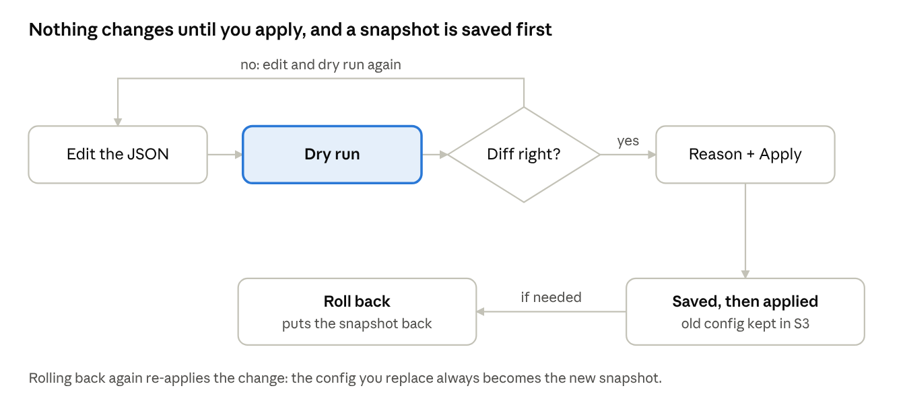

1. **Edit** the JSON in the editor. It checks the JSON as you type and underlines mistakes.
2. **Dry run.** The console asks Elasticsearch what would happen and shows the result. Nothing changes.
3. **Read the result** (below), give a **reason** (required; it goes into the audit log), then **Apply change**.
4. The console saves the current config to S3 as a **snapshot**, applies your change, and shows the new state. If anything goes wrong, **Roll back** restores the snapshot.

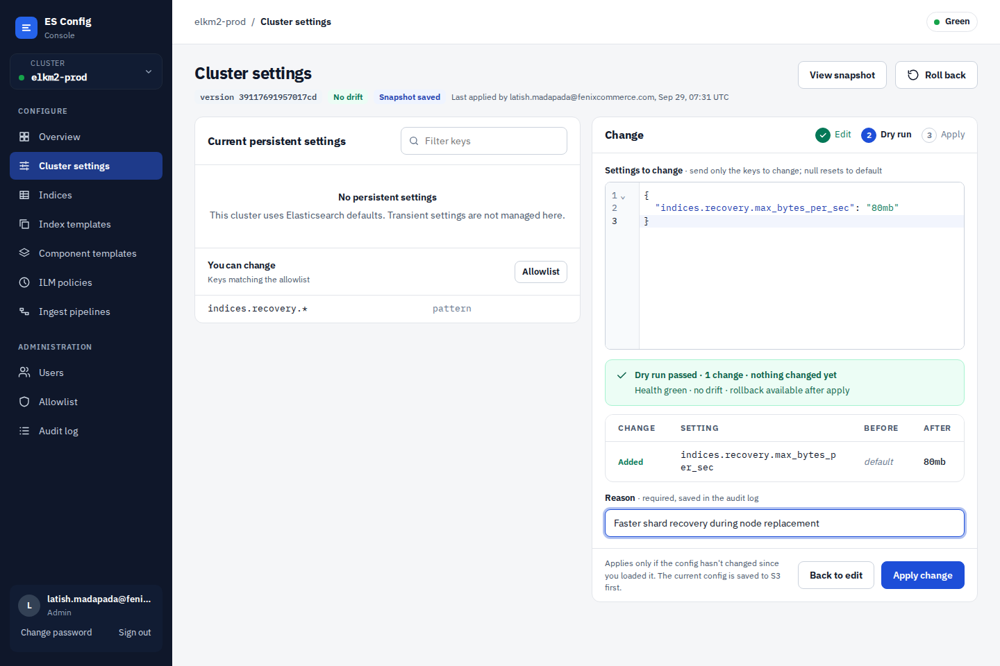

### Reading a dry run

| You see | It means |
| --- | --- |
| Green **Dry run passed · N changes** | Valid; the table lists every key that would be Added, Changed or Removed, with before and after values |
| Blue **No change** | The cluster already has exactly this; nothing to apply |
| Red box | The change would be refused (not allowlisted, invalid value, conflict); the box says why and nothing was changed |
| Yellow **Warning** | Allowed, but read it first (for example the cluster is yellow, or the change is permanent) |
| **Creates a new resource** | The template, policy or pipeline doesn't exist yet; rolling back later deletes it again |
| "default" or "—" in a column | The key isn't set before (or after), so Elasticsearch's default applies |

Editing the JSON after a dry run cancels it; run it again before applying.

### The status badges

Each page shows three badges under its title:

- **version** — a short fingerprint of the live config. Apply only goes through if the config still has this version, so you never overwrite someone else's change made while you were editing ("The config changed since you loaded it": reload and try again)
- **No drift / Drift detected** — drift means someone changed the config directly in Elasticsearch, outside the console, since it was last applied here. The dry run warns you, and a rollback is refused unless you tick the "force" box, because it would wipe that outside change
- **Snapshot saved / No snapshot yet** — whether there is something to roll back to. **View snapshot** shows it

### Rolling back

Click **Roll back**. The dialog shows who took the snapshot, when, and a preview of exactly what the rollback changes. Give a reason and confirm.

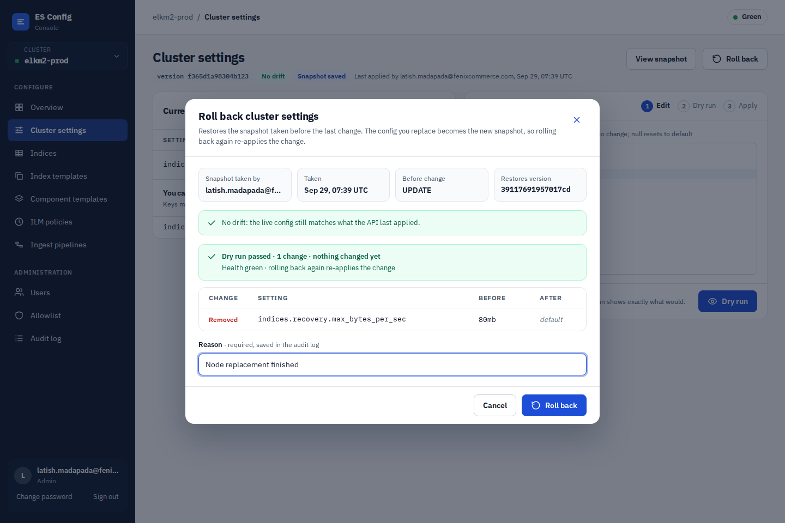

There is one level of rollback on this button, and it **swaps**: the config you replace becomes the new snapshot, so rolling back twice re-applies your change. Mappings can't be rolled back (Elasticsearch never removes fields).

**Older changes:** every applied change also keeps the state from just before it, so admins can undo *any* past change, not only the latest, from the audit log (see [Roll back from the audit log](#roll-back-from-the-audit-log)).

## Cluster settings

**Admins only.** It's under **Administration → Cluster settings** in the sidebar and applies to the cluster picked at the top. This page manages the cluster's **persistent** settings; send only the keys you want to change.

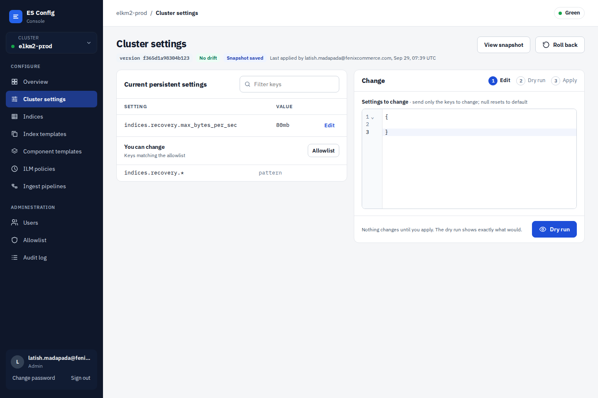

- **Left:** the current persistent settings (filter by key; **Edit** copies one into the editor). "No persistent settings" means the cluster runs on defaults. Transient settings are not managed here; if the cluster has any, a warning says so
- **You can change** (admins): the allowlisted keys and patterns, with **Add to change** for exact keys
- **Right:** the change editor

Examples of what to type:

| Goal | Editor content |
| --- | --- |
| Change one setting | `{"indices.recovery.max_bytes_per_sec": "80mb"}` |
| Change two at once | `{"cluster.routing.allocation.node_concurrent_recoveries": 4, "indices.recovery.max_bytes_per_sec": "80mb"}` |
| Reset a setting to its default | `{"indices.recovery.max_bytes_per_sec": null}` |

A key that isn't on the allowlist, or is on its deny list, is refused at the dry run:

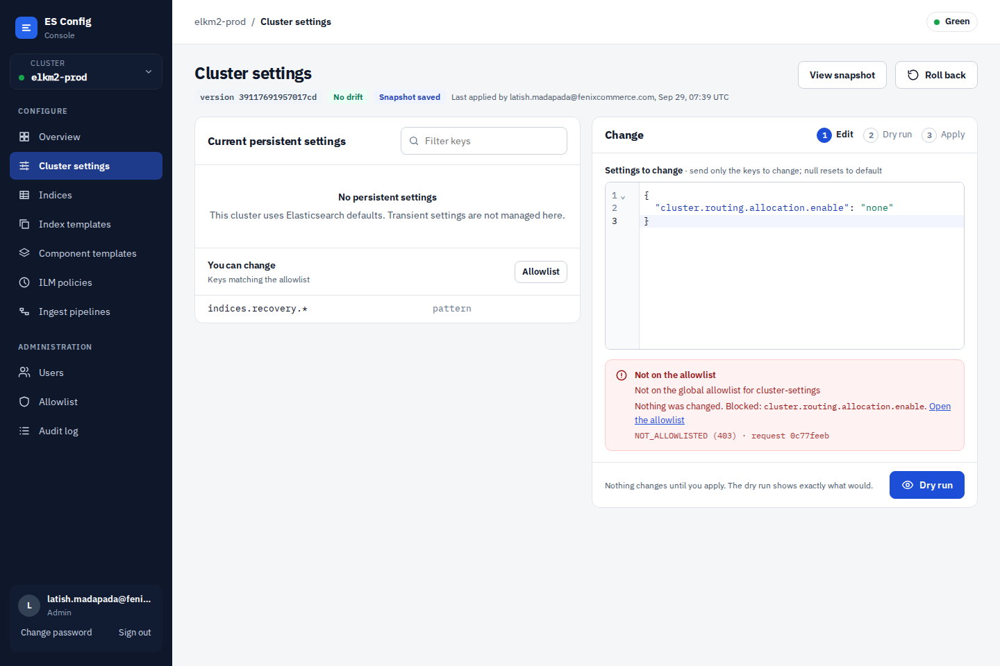

## Indices

The Indices page lists every index you may see (system indices starting with a dot are hidden) with its health, status and document count; click a name to open its settings or mapping, or **Browse** to see its documents.

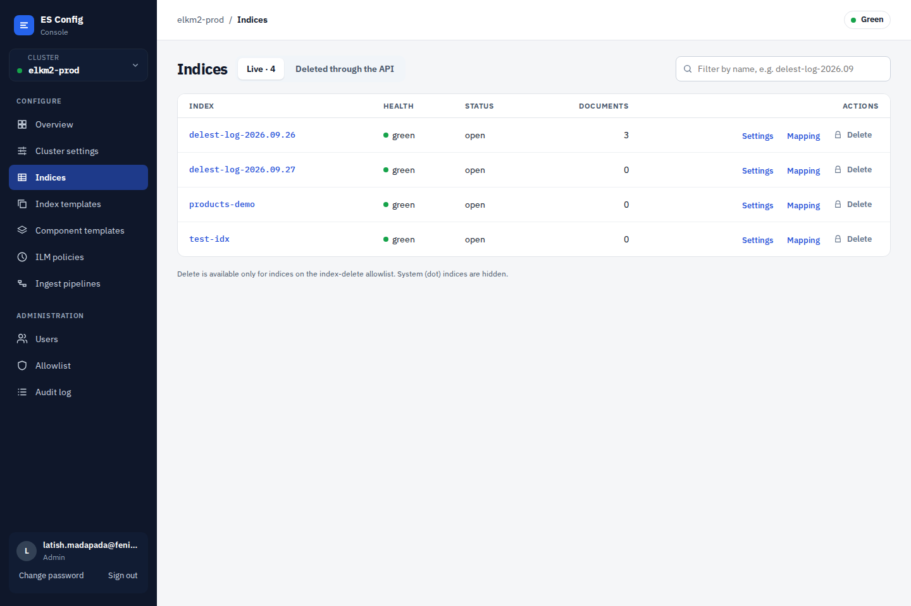

Type part of a name in the filter box to narrow the list (for example `delest-log-2026.09`). Very long lists show the first 500; filter to find the rest.

### Index settings

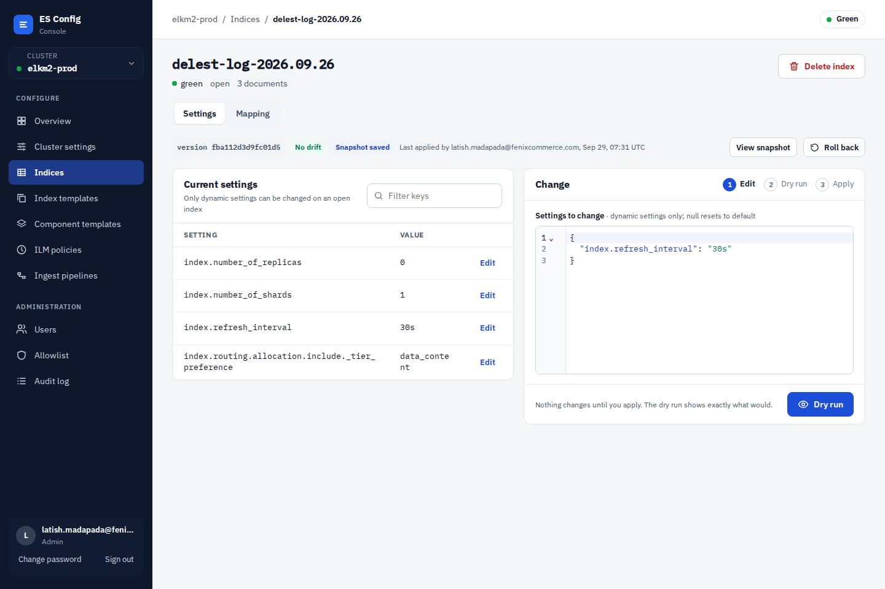

Only **dynamic** settings can be changed on an open index, for example `index.refresh_interval` or `index.number_of_replicas`. Static settings such as `index.number_of_shards` are refused ("This setting can't be changed on an open index"). Index settings have a snapshot and rollback like cluster settings.

```json
{ "index.refresh_interval": "30s" }
```

### Index mapping (add-only, permanent)

The Mapping tab lists every field and its type. You can **add** fields, never change or remove one: that's an Elasticsearch rule, and it's why there is no rollback here.

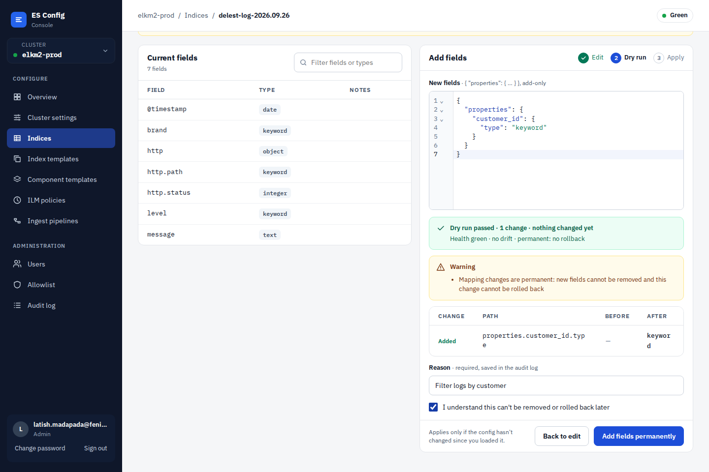

1. Type the new fields, for example `{"properties": {"customer_id": {"type": "keyword"}}}`.
2. **Dry run**, check the table lists only new paths, give a reason.
3. Tick **I understand this can't be removed or rolled back later**, then **Add fields permanently**.

Changing the type of an existing field is refused ("Mappings can only gain new fields"); that needs a new index and a reindex, outside this console.

### Deleting an index

Deleting destroys the index's documents for good. The console first saves its settings, mappings and aliases to S3 (not the data), so an empty copy can be recreated.

You need **Delete** access on the cluster, and the index must be on the index-delete allowlist. Click **Delete** in the list (or **Delete index** on the index page). The dialog shows the document count, size, aliases and data stream, and checks four things before it lets you continue:

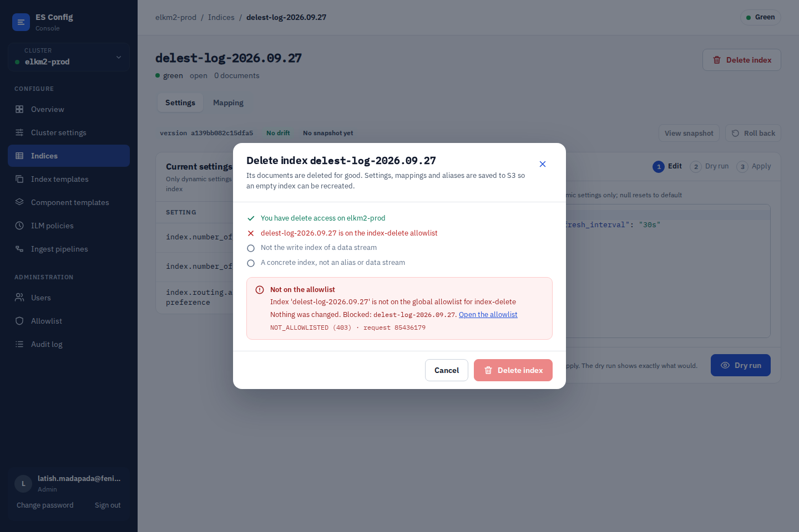

- you have delete access on this cluster
- the index is on the index-delete allowlist
- it isn't the current write index of a data stream (roll the data stream over first)
- it's a real index, not an alias or data stream name

When all four are green, type the index name exactly, give a reason and click **Delete index**. Admins see a grey Delete with a lock in the list when an index isn't allowlisted; for everyone else the dialog's checklist says so.

The **Deleted through the API** tab lists every index deleted this way, who deleted it, when and why; **Definition** shows the saved settings and mappings as JSON you can copy.

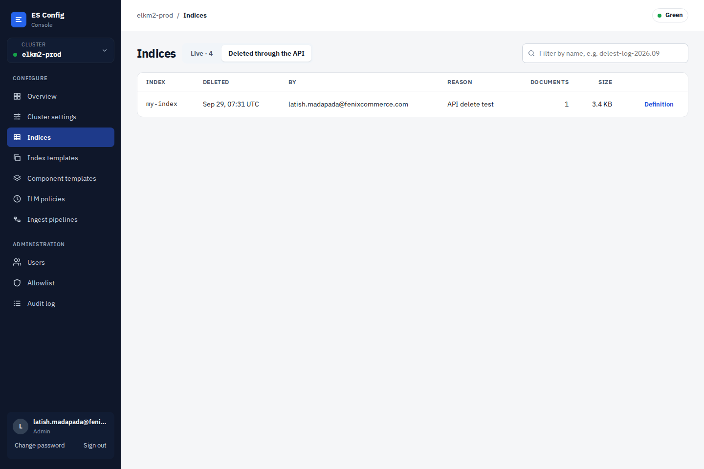

**Recreate** (on that tab, with Edit access on the index, or in the audit log) brings the index back **empty**, with its old settings, mappings and aliases. The dialog shows exactly what it gets; its documents can't come back, so reload them from their source afterwards.

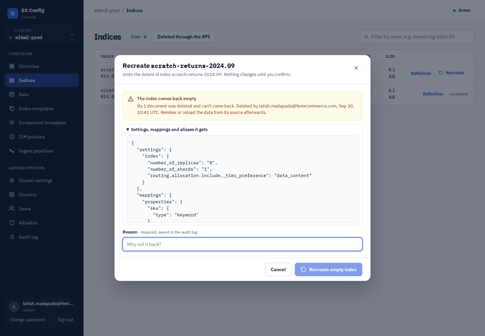

## Data: browse and edit documents

**Data** in the sidebar lets you search and read the documents in an index, filter them, pick columns, open one, and export the results. With Edit access you can also change documents, one at a time or in bulk, and undo those changes (see [Edit, add or delete a document](#edit-add-or-delete-a-document)). You need at least View on the index. System indices (names starting with a dot) can't be opened, and a pattern only shows the indices you may see.

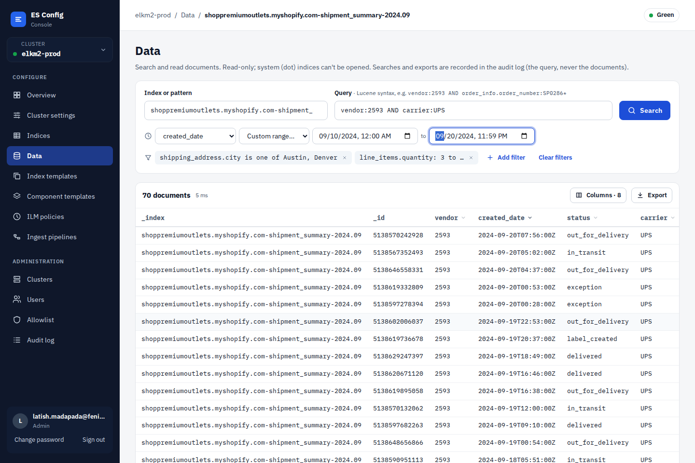

1. **Pick an index.** Type its name, or a pattern with `*` (for example `shoppremiumoutlets*-2024.*`), and press **Search**. The box suggests index names as you type. On the **Indices** page, **Browse** on any row opens it here.
2. **Query** (optional): Lucene syntax, the same as Kibana's Lucene mode. Words separated by spaces must all match. See the examples below.
3. **Time range:** choose the date field and a range (last 15 minutes up to last year, or **Custom range…** with from/to). Times are in your browser's time zone.
4. **Filters:** **Add filter** → field, operator, value. Operators: *is*, *is not*, *is one of*, *is not one of*, *contains* (case-insensitive), *is between* (numbers or dates), *exists*, *does not exist*. Fields inside nested lists (like `line_items.sku`) work too. Click a filter to change it, × to remove it. Red filters exclude.

| To find | Type in Query |
| --- | --- |
| One vendor | `vendor:2593` |
| Two conditions | `vendor:2593 AND carrier:UPS` |
| Either value | `status:(delivered OR in_transit)` |
| Starts with | `order_info.order_number:SP0286*` |
| A range | `order_info.total_price:[100 TO 200]` |
| Not | `NOT status:delivered` |
| Field is set | `_exists_:tracking_number` |

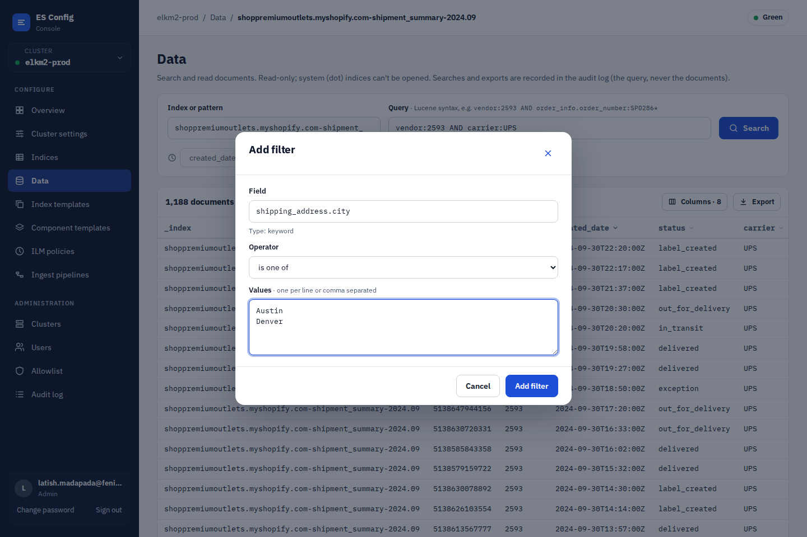

### The results table

- The count at the top is exact ("12,500 documents"), with how long Elasticsearch took
- **Sort:** click a column heading with a small arrow (keyword, number and date fields). Click again for ascending, a third time to go back to relevance. Text fields can't be sorted
- **Rows per page** 10, 25, 50 or 100, and the arrows at the bottom page through. Only the first 10,000 matches can be paged through (Elasticsearch's limit); narrow the search to reach the rest
- **Columns** chooses what to show and in what order. Pick a whole object (`order_info`, shown as JSON) or a single field inside it (`order_info.order_number`). Your choice is remembered per index in this browser. **Reset to default** shows the first document's own fields again

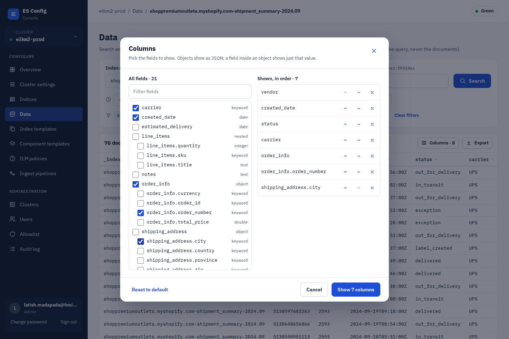

The address bar keeps the index, query, filters, sort and page, so you can bookmark a search or send the link to a colleague (they still need View access).

### Looking at one document

Click a row. **Fields** lists every field with its type and value; **JSON** shows the document as stored. **Copy JSON** copies it. **Previous** / **Next** (or the arrow keys) move through the rows on the page.

In **Fields**, **+** next to a value adds the filter "field is this value", and **−** adds "field is not this value".

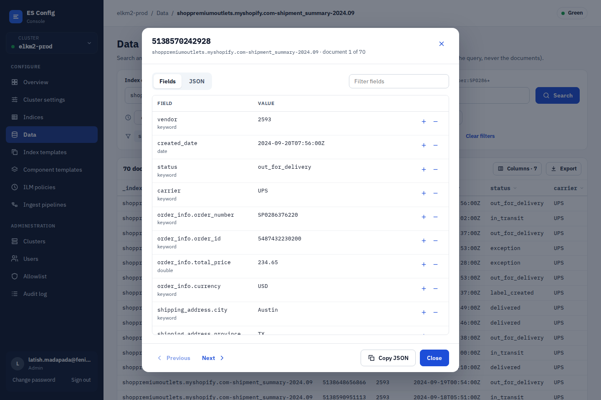

### Export

**Export** downloads what the current search, filters and sort match: **CSV** (opens in Excel; the shown columns or every field), **JSON** or **NDJSON**, up to 10,000 documents. Values that could run as a spreadsheet formula are made safe.

Exports and searches are recorded in the audit log with your email and the query, never the documents themselves. An export can hold customer details, so store and share the file accordingly.

### Edit, add or delete a document

With **Edit** access on an index you can change its documents. Every change needs a reason, is recorded in the audit log, and keeps the document as it was so it can be put back.

**Edit a document**

1. Click a row, then **Edit**.
2. Change the JSON (it's the whole document; fields you remove are removed).
3. **Preview changes** shows exactly which fields change, from what to what. Nothing is saved yet.
4. Enter a reason and click **Save document**.

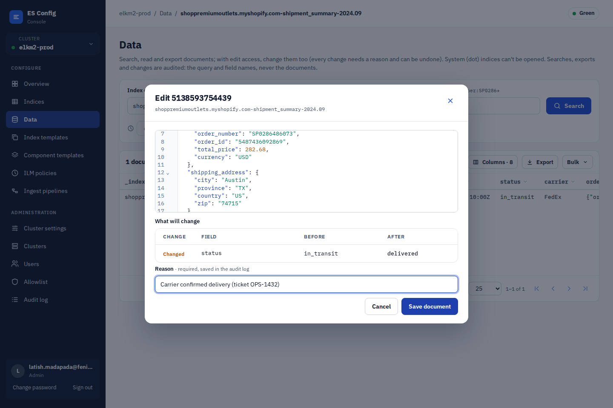

If someone else changed the same document after you opened it, saving is refused ("changed since you read it"), so their change isn't lost: reload the page and edit again.

**Add a document:** **New document** above the results. Pick the index (only indices you may edit are listed), give an id or leave it empty for an automatic one, type the JSON (or **Start from a copy of the first row**), add a reason and **Create document**.

**Delete a document:** open it, **Delete**, type its id and a reason. A copy is kept.

Documents in data streams (indices named `.ds-…`) are read-only here.

### Recent changes and roll back

When you open an index or pattern, **Recent changes** at the top lists the newest changes on it: document edits, adds, deletes, restores and bulk changes, with who, when and why. **Show all** lists up to 10.

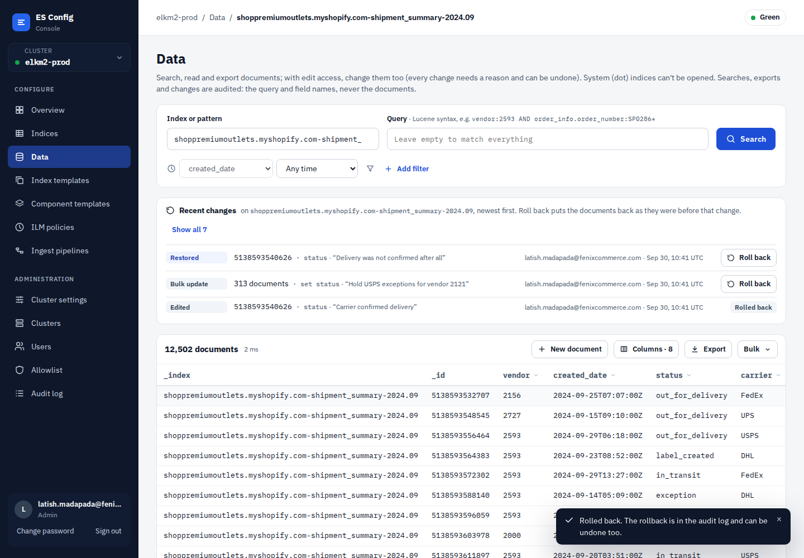

**Roll back** (with Edit access on that index) opens a dry run of the rollback: what the document or documents will look like again, field by field. Give a reason and confirm; for a bulk change, also type the number of documents. The change you undo is then marked **Rolled back**, and the rollback itself appears in the list, so it can be undone too.

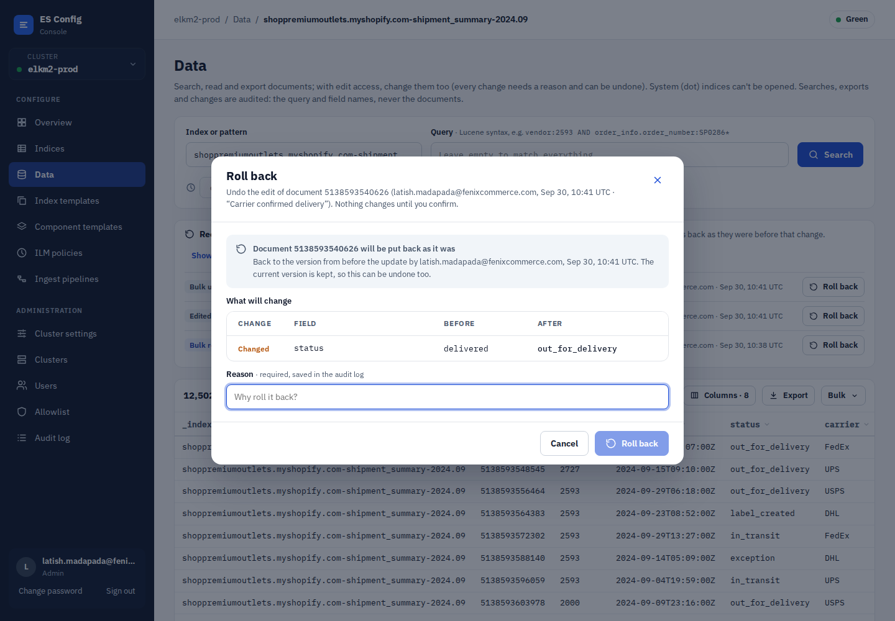

### Undo a change to a document

Open the document and choose the **History** tab. It lists every change made through the console or API, newest first, with who, when, why and which fields.

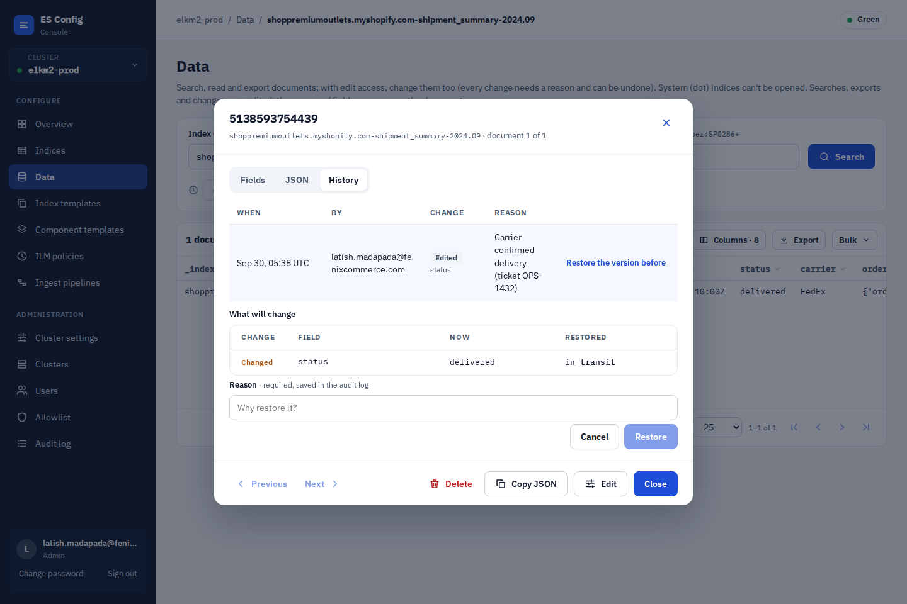

**Restore the version before** shows what would change back; add a reason and click **Restore**. A deleted document is recreated; a document you created can be removed again (**Undo the create**). The restore itself is saved in the history too, so it can be undone as well.

### Bulk update or delete matching documents

**Bulk** (next to Export) changes every document the current search matches: the index or pattern, query, filters and time range you see. Up to 10,000 documents at a time. Bulk update needs Edit, bulk delete needs Delete, on every index involved.

1. Search and filter until the table shows exactly the documents you mean.
2. **Bulk → Update matching documents…**: add the fields to set (value as plain text, or JSON such as `123`, `true`, `null`), and optionally fields to remove. For **Delete matching documents…** there's nothing to fill in.
3. **Dry run** (required). It shows how many documents will change, examples of the before and after, and warnings (for example when there's no query or filter, so it would hit every document).
4. Enter a reason and **type the number of documents** to confirm, then click **Update N documents** / **Delete N documents**.

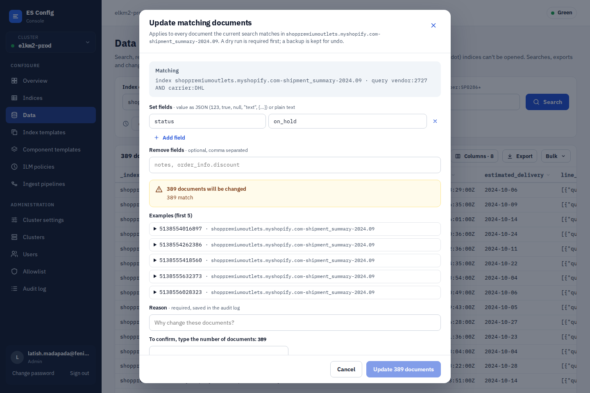

Before writing anything, every matching document is backed up. If the matching documents changed after the dry run (someone added or edited one), you're asked to run the dry run again. A document edited by someone else in the last moment is left alone and reported as skipped.

### Undo a bulk change

**Bulk → Bulk changes and undo…** lists every bulk update and delete on the cluster, with who, when, why and how many documents.

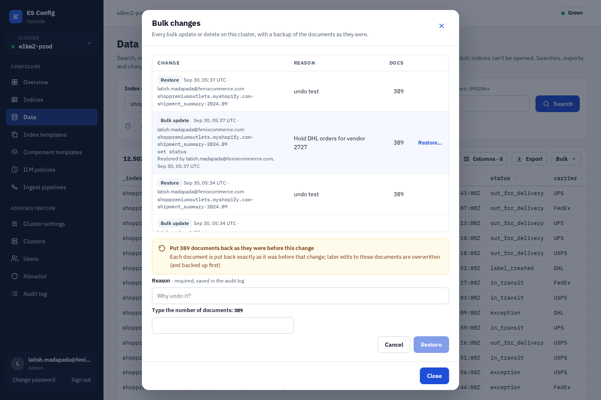

**Restore…** puts every document of that change back exactly as it was before (deleted ones come back). Later edits to those documents are overwritten, but they're backed up first, so the restore can be undone too. It asks for a reason and the number of documents, like the change itself.

## Templates, ILM policies and ingest pipelines

Index templates, component templates, ILM policies and ingest pipelines share one screen: a list on the left, the selected item's full definition on the right.

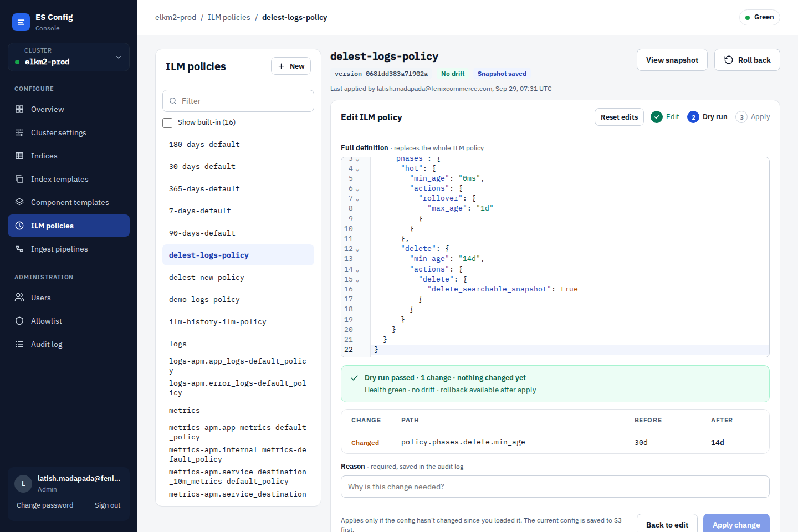

- **Pick one** from the list (filter by name). Built-in items (names starting with a dot or containing `@`) are hidden until you tick **Show built-in**
- **Edit** the whole definition: what you apply replaces it completely, so keep the parts you don't change. **Reset edits** puts back what's live
- **Dry run** shows the diff, plus what Elasticsearch would do with it:
  - **Index templates:** the settings and mappings a new matching index would get, and any other templates that overlap
  - **Ingest pipelines:** each sample document after processing (see below)
- **New** creates one: enter a name, start from the example, dry run (it says "Creates a new resource"), then **Create**. Rolling back a new item deletes it

The allowlist decides which names you may change, and for index templates which `index_patterns` they may target. Templates matching every index (`*`) or system indices are refused unless the allowlist explicitly allows them.

### Ingest pipelines: test with sample documents

Put one or more example documents in the **Sample documents** box before the dry run to see exactly what the pipeline does to them.

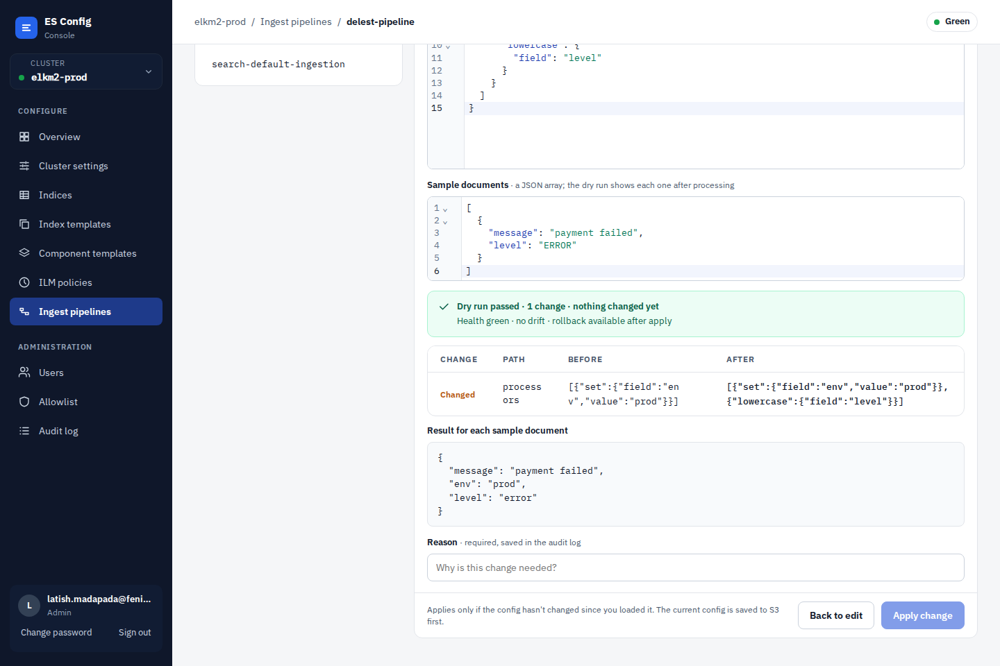

### ILM policies: be careful with the delete phase

An ILM policy is a schedule Elasticsearch follows on its own: for example roll over to a new index every day, then delete indices older than 30 days. A policy change applies to **every index that uses it** on ILM's next run.

- Shortening a delete phase (say `min_age` from `30d` to `14d`) deletes every matching index older than 14 days within minutes
- Rolling back restores the policy, **not** the deleted indices
- So read the dry run's diff line by line, and check which indices use the policy before you apply

## Admins: clusters

Admins add, change and remove Elasticsearch clusters here, without touching the server or restarting anything. **Administration → Clusters** lists every cluster with its nodes and live status.

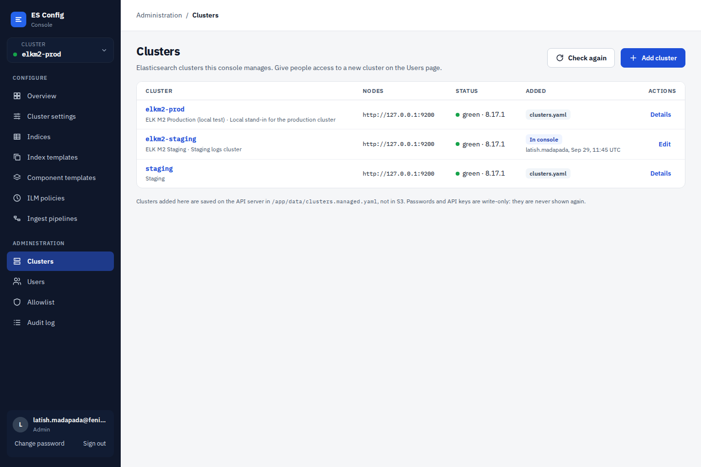

The **Added** column shows where each cluster comes from:

| Badge | Where it's defined | What you can do here |
| --- | --- | --- |
| **In console** (with who added it, and when) | Added on this page. Saved on the API server in `data/clusters.managed.yaml`, **not in S3** | **Edit**, test, remove |
| **clusters.yaml** | The server's `config/clusters.yaml` file | **Details** only; change it in the file on the server |

**Check again** pings every cluster. A cluster that can't be reached shows the reason (for example a wrong password or a blocked port) in the Status column.

### Add a cluster

1. Click **Add cluster**.
2. **Cluster id**: lowercase letters, digits, `-` and `_`, for example `elkm2-staging`. It appears in addresses and the audit log, and can't be changed later.
3. **Display name** and **Description** (optional).
4. **Node URLs**: one per line, with `http://` or `https://` and the port, for example `http://node1.elkm2.stage.int.fenixcommerce.com:9200`. Two or three nodes are better than one.
5. **Authentication**: **Username and password** (usual), **API key**, or **No password** (for a cluster with security turned off). The password is optional: if the cluster needs none, leave it empty and the cluster is saved without authentication (the dialog says so under the field). Otherwise use the cluster's service account (for example `es_console_api`) with the `config_api_writer` role (see `docs/es-lockdown.md`), not `elastic` or a personal login.

    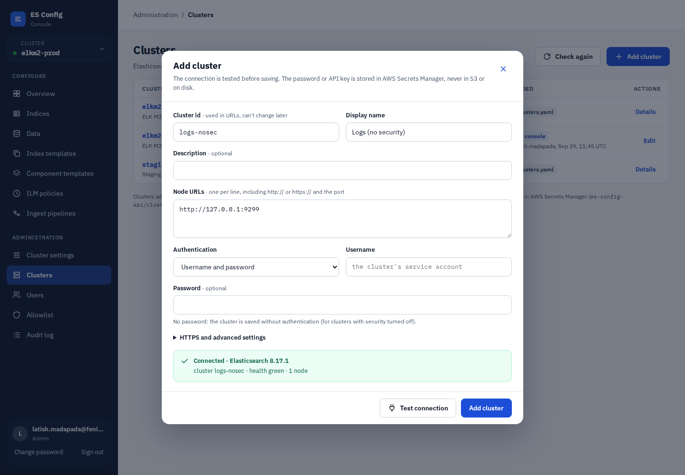
6. For HTTPS with your own certificate authority, open **HTTPS and advanced settings** and paste the CA certificate (PEM). The same section has **Verify TLS certificates** (leave it on), the request timeout and tags.
7. Click **Test connection**. Green shows the Elasticsearch version, cluster name, health and node count; red says what went wrong. Nothing is saved yet.
8. Click **Add cluster**. It is tested again, saved, and appears in the cluster switcher straight away.

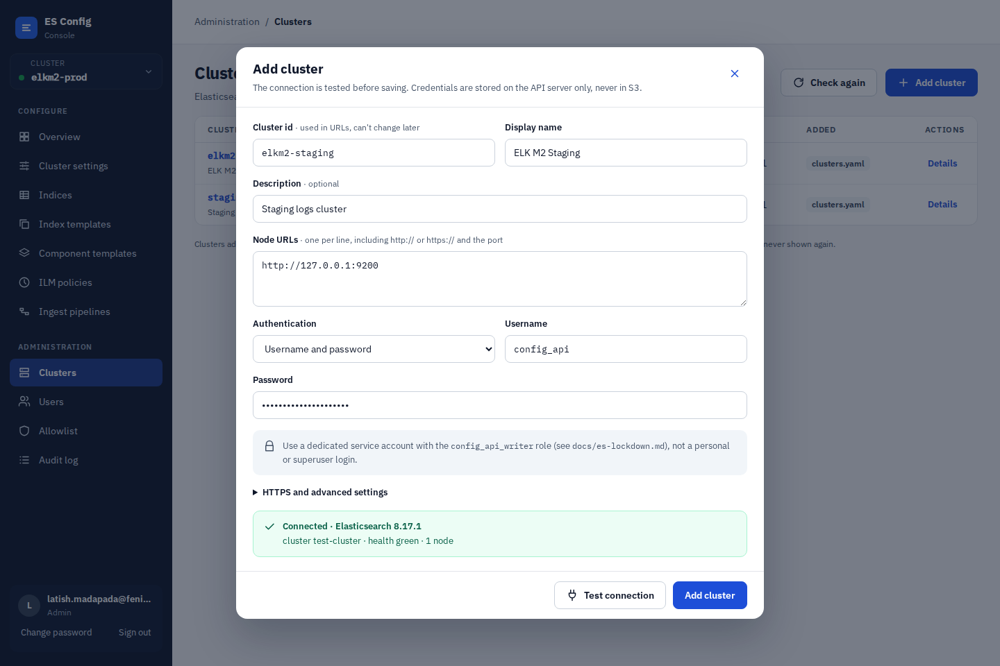

If the connection fails when you save, nothing is saved and the reason is shown. To save a cluster that is down right now (for example one still being built), tick **Save anyway, without a working connection** and save again.

**Then give people access:** a new cluster is visible to admins only. Open **Users**, select each person and set their level on the new cluster (users with **All clusters** get it automatically).

### Change or remove a cluster

Click **Edit** on a cluster added in the console.

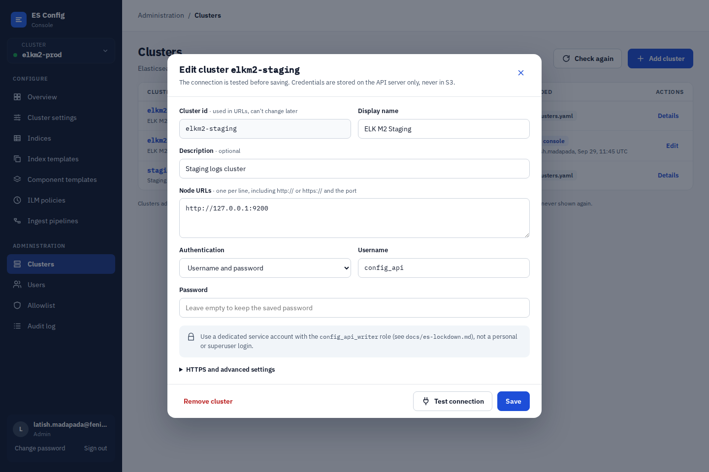

- The saved password or API key is never shown. Leave the field empty to keep it, or type a new one to replace it (changing the username needs the password too)
- A saved CA certificate can be replaced by pasting a new one, or removed with its checkbox
- **Save** tests the connection first, like adding
- **Remove cluster** asks you to type the cluster id. The console stops managing the cluster, everyone's access to it is removed, and its allowlist override is deleted. Nothing changes on the Elasticsearch cluster itself, and its snapshots and audit history stay in S3

Every add, change and removal is in the audit log (`ADMIN_CLUSTER_CREATE`, `ADMIN_CLUSTER_UPDATE`, `ADMIN_CLUSTER_DELETE`) with who did it; passwords and API keys never are.

**Where the credentials live.** The connection details are kept in a file on the API server (`data/clusters.managed.yaml`); the password or API key is stored in **AWS Secrets Manager** as `es-config-api/clusters/<cluster id>`. It's never written to S3 or to that file, never returned by the API, and never shown in the console after you save it. **Details** (and the edit dialog) show where it is, and warn if the secret is missing.

## Admins: users and passwords

Admins add people by email, choose their access per cluster, and hand over a generated password as a CSV file.

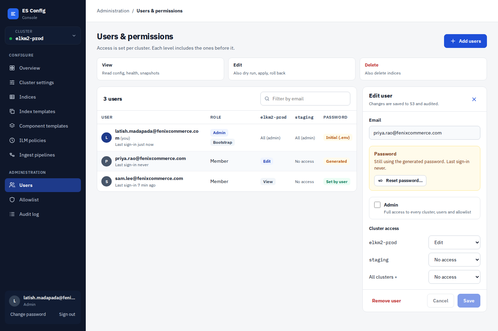

The table shows each user's role, their level on each cluster, when they last signed in and their password status:

| Password status | Meaning |
| --- | --- |
| Generated | Still using the password an admin generated |
| Initial | A bootstrap admin still using the first-admin password (from the `es-config-api/app` secret in AWS Secrets Manager) |
| Set by user | They changed it themselves |
| Locked | 5 failed sign-ins; locked for 15 minutes or until reset |

### Add users

1. Click **Add users**.
2. Enter one or more emails (one per line, or separated by commas).
3. Choose their access on each cluster (**All clusters** applies to every cluster, including ones added later), optionally with index rules (below), or tick **Make admin**.
4. Click **Create**. It's all or nothing: if one email already exists, nobody is created and the dialog names who.

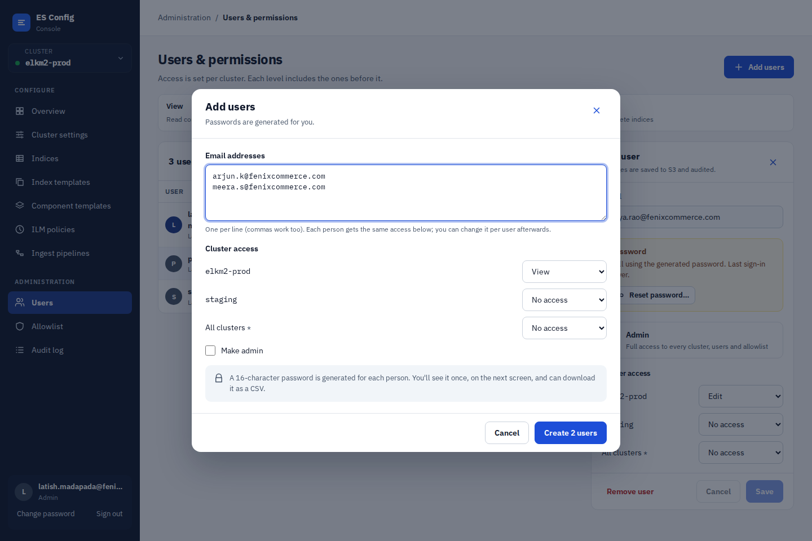

The next screen shows each generated password **once**. Click **Download CSV** (`username,password`) or copy each password, and send each person theirs privately. If you close the dialog without downloading, it warns you first; after that the passwords can't be shown again, so you'd reset them.

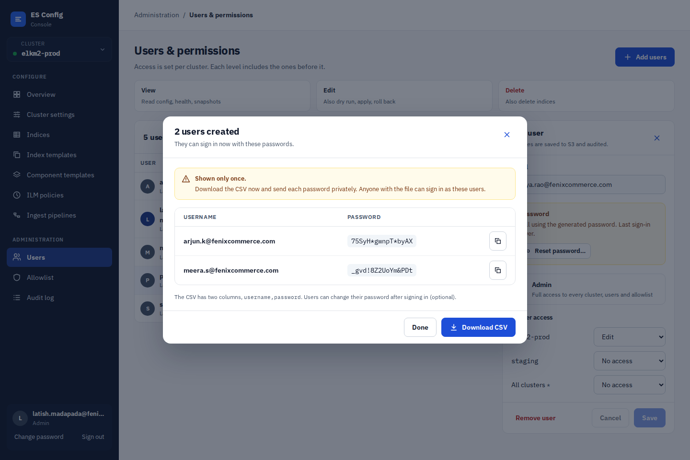

### Access per index (index rules)

Next to each cluster's level, **Indices** opens its index rules. Each rule is an index pattern (`*` matches anything) and a level:

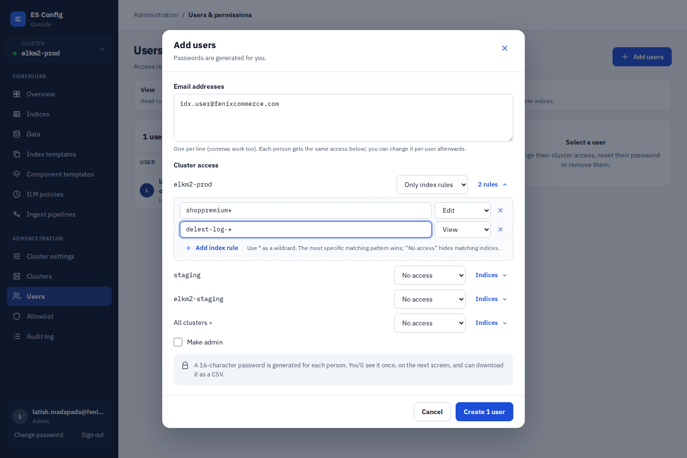

| You want | Cluster level | Index rules |
| --- | --- | --- |
| Read everything, change only the shipment indices | View | `shoppremium*-shipment_summary-*` → Edit |
| Everything except payments | Edit | `payments-*` → No access |
| Only two groups of indices, nothing else (no templates, ILM, pipelines) | Only index rules | `shoppremium*` → Edit, `delest-log-*` → View |

When several rules match an index, the most specific one wins: an exact index name beats a pattern, and a longer pattern beats a shorter one (`shop-orders-*` beats `shop*`). An index no rule matches gets the cluster level. Users who have rules show **+N index rules** in the table.

### Change access, reset a password, remove a user

Click a user to open the panel on the right.

- **Cluster access / Admin:** change and **Save**. It applies to their next request; no sign-out needed
- **Reset password…:** generates a new password shown once with a CSV, ends all their sessions, and unlocks a locked account
- **Remove user:** asks you to confirm. They can't sign in any more; their past changes stay in the audit log

Passwords are stored as one-way hashes in AWS Secrets Manager, one secret per user; nobody, including admins, can read a password back. You can't remove yourself or take away your own admin rights, and bootstrap admins (set in `.env` on the server) can't be changed here. If the only admin is locked out, someone with server access runs `docker compose exec es-config-api python -m app.cli reset-password <email>`.

Treat a downloaded CSV like a key: anyone holding it can sign in as those users. Delete it once each person has their password.

## Admins: the allowlist

The allowlist decides what may be changed at all, for everyone including editors: anything not on it is locked, and a deny pattern always wins over an allow.

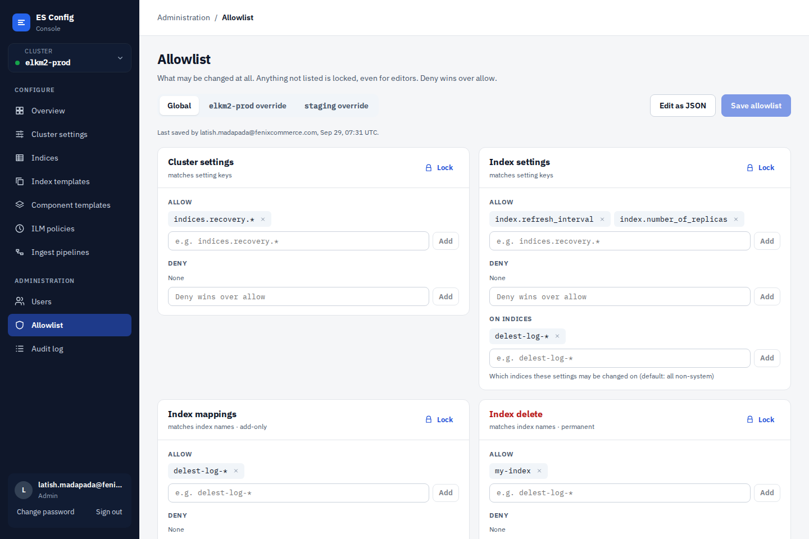

There is one card per config type:

| Card | Allow / deny patterns match | Extra |
| --- | --- | --- |
| Cluster settings | setting keys, e.g. `indices.recovery.*` | — |
| Index settings | setting keys, e.g. `index.refresh_interval` | **On indices**: which indices (default: all except system indices) |
| Index mappings | index names, e.g. `delest-log-*` | add-only |
| Index delete | index names, e.g. `my-index` | keep these narrow: deletes are permanent |
| Index templates | template names | **Index patterns**: which `index_patterns` templates may target |
| Component templates, ILM policies, Ingest pipelines | names | — |

- **Unlock** a locked card, type a pattern and press Enter (or **Add**); click × on a pattern to remove it. **Lock** turns a whole type off again
- Patterns use `*` (any characters) and `?` (one character). System indices (starting with a dot) only match patterns that also start with a dot
- **Save allowlist** applies it; **Discard** throws away unsaved edits. **Edit as JSON** shows the same rules as JSON for bulk edits (nothing is saved until you click Save)

**Global vs cluster override.** The **Global** tab applies to every cluster. A cluster's **override** tab replaces the global list for that cluster only: **Create override from global** starts one as a copy, **Remove override** goes back to global.

Every save is recorded in the audit log with the before and after rules.

## Admins: the audit log

The audit log records every change, dry run, rollback, delete, sign-in and admin action, including the ones that were refused, one day at a time in UTC.

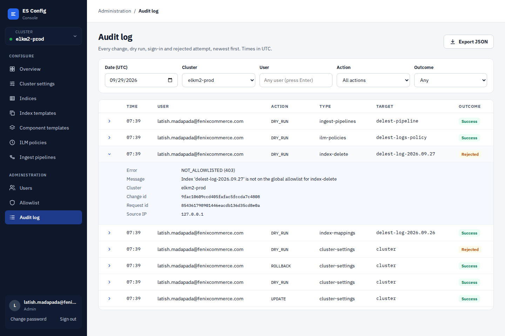

- **Filters:** date (UTC), cluster, user, action (UPDATE, ROLLBACK, RESTORE, DRY\_RUN, INDEX\_DELETE, INDEX\_RECREATE, DATA\_SEARCH, DATA\_EXPORT, ADMIN\_\* including ADMIN\_CLUSTER\_\*, AUTH\_\*) and outcome (Success, Rejected, Failed, No change). The filters stay in the address bar, so you can share a filtered view
- **Expand a row** (click it) to see the error code and message, blocked keys, the reason given, the diff of what changed, the change and request IDs, and the source IP
- **Export JSON** downloads what the filters show
- The page shows up to 500 events; narrow the filters if there are more

### Roll back from the audit log

Every successful change has a **Roll back** button on its row:

| Change | What Roll back does |
| --- | --- |
| Cluster settings, index settings, templates, ILM policies, ingest pipelines | Puts the config back to how it was just before that change, even if other changes came after it (they are undone too; the dry run says so and shows the diff). A change that created something deletes it again |
| Document edit, add, delete, restore | Puts that document back as it was before the change |
| Bulk update, delete or restore | Puts every document of that change back as it was |
| Index delete | **Recreate**: the index comes back empty, with its settings, mappings and aliases |

Mapping changes have no button: Elasticsearch can't remove fields.

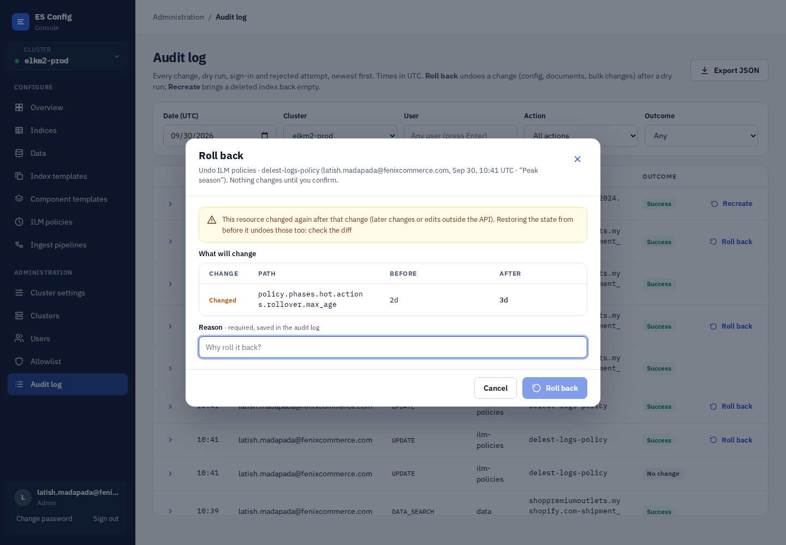

Each rollback starts with a dry run and changes nothing until you give a reason and click **Roll back**. It is audited like any change (`RESTORE`, `DATA_DOC_RESTORE`, `DATA_BULK_RESTORE`, `INDEX_RECREATE`) and has its own Roll back button, so it can be undone too. A change already undone shows **Rolled back** instead of the button.

The short request ID at the bottom of every red error box in the console is the start of the Request ID here, so a user can tell you exactly which attempt failed. Passwords are never written to the audit log.

## Messages you may see

A red box always means nothing was changed; its last line shows the error code and a short request ID an admin can look up in the audit log.

| Message | Why | What to do |
| --- | --- | --- |
| Not on the allowlist | The key, index or name isn't allowlisted (or is denied) | Ask an admin; admins get an **Open the allowlist** link |
| You don't have access for this | Your level on this cluster is too low | Ask an admin for Edit (or Delete) |
| Changed outside the API (drift) | Someone changed it directly in Elasticsearch | Check the live config; roll back only with the force box if you really want to overwrite their change |
| The config changed since you loaded it | Someone applied a change while you were editing | Reload the page; your edits stay in the editor until you do |
| Another change is in progress | Someone is changing the same thing right now | Wait a few seconds and try again |
| Cluster health is red | Changes are held back while the cluster is red | Fix the cluster first, or tick the force box if the change is the fix |
| This setting can't be changed on an open index | A static index setting | Not possible here; it needs a closed index or a new index |
| Mappings can only gain new fields | You tried to change or remove a field | Add a new field instead, or reindex outside the console |
| Elasticsearch rejected the change | Unknown setting or invalid value | The message has Elasticsearch's reason; fix the JSON |
| Invalid JSON | A typo in the editor (red underline) | Fix the highlighted line |
| Can't reach the cluster | The API server can't connect to Elasticsearch | Tell whoever runs the API server |
| System and hidden indices can't be browsed | The name or pattern starts with a dot | Browse the normal index instead |
| No saved state for that change | The change is older than change history (before this version), or not a change to that resource | Use **Roll back** on the page for its latest change |
| Changed since you read it | Someone else edited the document after you opened it | Reload the page and make your edit again |
| Run the dry run again | The documents a bulk change matches changed after the dry run, or it's older than 15 minutes | Click **Dry run again** and check the new count |
| … documents match; bulk changes are limited to 10,000 | The search matches too many documents | Add a filter or time range, or split it by date |
| The API's Elasticsearch account may not write documents | The service account lacks the `write` privilege | Whoever runs the server: add `write` to the `config_api_writer` role (`docs/es-lockdown.md`) |
| You need 'edit' access on index … | Your level on that index is too low | Ask an admin for an index rule |
| Only the first 10,000 results can be paged through | You paged past Elasticsearch's limit | Add a filter or time range, or change the sort |
| The API's Elasticsearch account may not read documents | The service account lacks the `read` privilege | Whoever runs the server: add `read` to the `config_api_writer` role (`docs/es-lockdown.md`) |
| Can't connect (adding or editing a cluster) | Wrong URL, port, password or CA certificate, or the security group blocks the API server | Fix the setting the message names and **Test connection** again |
| A cluster with this id already exists | The id is used by another cluster | Choose another id |
| Defined in config/clusters.yaml | That cluster is in the server's file | Change it in the file on the server |
| The clusters file on the server can't be written | The server's `data` folder isn't writable by the API | Whoever runs the server: `sudo chown 10001:10001 data && chmod 700 data` |
| Your session ended | 12 hours passed, or your password was changed or reset | Sign in again |
| Account locked | 5 wrong passwords | Wait 15 minutes or ask an admin to reset your password |

## Good practice and FAQ

**Good practice**

- Read the whole dry-run table before applying, not just the green banner
- Write reasons a colleague will understand in six months: what and why, with a ticket number if there is one
- Change one thing at a time; it keeps rollback simple (there is only one level)
- Narrow a bulk change with filters until the table shows only the documents you mean, and read the dry-run examples before confirming
- Keep index-delete and ILM allowlist patterns as narrow as possible
- Don't change configuration directly in Elasticsearch; it causes drift and blocks rollbacks

**FAQ**

- **Can I undo a rollback?** Yes: roll back again. Rollback swaps the live config and the snapshot.
- **Can I go back two changes?** The **Roll back** button on a page goes back one step. To undo an older change, an admin uses **Roll back** on that change in the audit log.
- **Why is a Roll back button greyed out?** Nothing has been changed through the console yet, so there is no snapshot.
- **Why can't I roll back a mapping?** Elasticsearch never removes fields from a mapping.
- **Can I recover a deleted index's documents?** No. Only its settings, mappings and aliases are saved: **Recreate** brings the index back empty.
- **Who can see my changes?** Admins, in the audit log, with your email, time, reason and diff.
- **Do I need to sign out when an admin changes my access?** No, it applies to your next click.
- **Can scripts do the same things?** Yes, through the API with a token from sign-in; see [API_REFERENCE.md](API_REFERENCE.md).
- **Can I change a document in Data?** Yes, with Edit access on its index: open it and **Edit**. Every change keeps the previous version under **History**.
- **Can I undo a bulk change?** Yes: **Bulk → Bulk changes and undo… → Restore…**. Every document is put back as it was.
- **Why can't I see an index my colleague sees?** Your access may be limited to some indices; ask an admin.
- **Why don't I see `.kibana` or other dot indices in Data?** System indices are never shown, on purpose.
- **How do I add a new Elasticsearch cluster?** Admins: **Administration → Clusters → Add cluster**; then give people access on **Users**.
- **Is there SSO?** Not yet; sign-in is by email and password.
